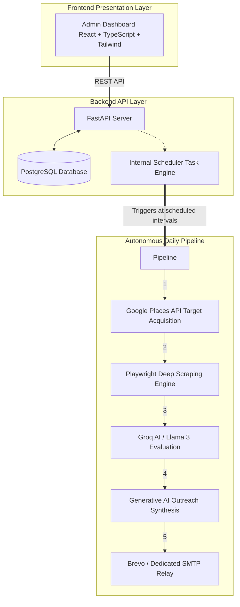

<div align="center">
  

  <a href="https://git.io/typing-svg"></a>

  <p>An enterprise-grade, end-to-end B2B lead generation pipeline. Discovers, deeply enriches, qualifies, and engages prospects via AI-driven outreach.</p>

  <p>
    
    
    
    
    
  </p>
</div>

---

## 📖 Table of Contents

- [Brand Identity](#-brand-identity)
- [Project Overview](#-project-overview)
- [System Architecture](#-system-architecture)
- [Prerequisites](#-prerequisites)
- [Local Development Setup](#-local-development-setup)
- [Environment Variables](#-environment-variables)
- [Deployment](#-deployment)
- [License](#-license)

---

## 🏛 Brand Identity

### Vision
To completely automate the B2B sales development lifecycle with intelligent, autonomous AI agents, eliminating the friction between prospect discovery and meaningful engagement.

### Mission
Empowering high-performance B2B sales teams by providing a tirelessly working, 24/7 AI-driven outreach pipeline that seamlessly discovers, qualifies, and engages ideal prospects at scale.

### Brand Guidelines
- **Core Identity:** Cold Scout (also referred to as LocalLeadPro in regional deployments).
- **Tone & Voice:** Professional, Enterprise-grade, Authoritative, yet approachable and cutting-edge.
- **Visual Palette:** Monochromatic elegance. The primary brand colors are sleek Black, crisp White, and sophisticated Grayscale, designed to project trust, luxury, and modern technological capability.
- **UI/UX Philosophy:** Premium interactions utilizing glassmorphism, dynamic micro-animations, and uncompromised responsive performance.

---

## 🚀 Project Overview

**Cold Scout (AI Lead Generation System)** fully automates the traditional sales development lifecycle. By utilizing a distributed architecture and advanced LLM-powered qualification pipelines, this platform functions as a tireless, fully autonomous Sales Development Representative (SDR).

### Key Features
1. **🔍 Organic Discovery**: Programmatically leverages Google Places to source local businesses matching hyper-specific targeting parameters.
2. **🧠 AI Qualification**: Extracts company website data and utilizes Llama 3 (via Groq) to autonomously qualify leads against strict Ideal Customer Profiles (ICPs).
3. **✉️ Hyper-Personalization**: Analyzes prospect pain points and industry standing to generate highly customized, enterprise-level outreach campaigns.
4. **📊 Real-time Dashboard**: A premium React-based command center for managing campaigns, monitoring background automation tasks, and analyzing conversion metrics.
5. **🤖 Smart Notifications**: Integrated Telegram & WhatsApp bots for real-time intelligent alerts regarding newly discovered leads, successful qualifications, and system health status.
6. **🚀 Automated Monitoring**: Proactive operational monitoring utilizing GitHub Actions and continuous chron-job tracking to ensure flawless 24/7 uptime.
7. **🛡️ Scalable Backend**: Engineered on FastAPI and PostgreSQL with `async` database connectivity optimized for high-throughput, non-blocking data ingestion and web scraping.

---

## 🏗 System Architecture

The workflow operates on a decoupled, highly-available asynchronous pipeline with robust state-machine management.



---

## 🛠 Prerequisites

Before deploying or initiating local development, ensure the underlying environment meets the following specifications:
- **Python 3.11+**
- **Node.js 18+** & **npm/yarn**
- **PostgreSQL 14+** (if circumventing containerized deployment)
- **Docker & Docker Compose** (Highly recommended for reproducible environments)

---

## 💻 Local Development Setup

To orchestrate the complete system on a local workstation, follow this precise procedure.

### 1. Backend Setup (FastAPI)

1. **Clone the repository:**
   ```bash
   git clone https://github.com/colddsam/coldscout.git
   cd coldscout
   ```

2. **Initialize the Python Virtual Environment:**
   ```bash
   python -m venv venv
   # Windows:
   venv\Scripts\activate
   # macOS/Linux:
   source venv/bin/activate
   ```

3. **Install Core Dependencies:**
   ```bash
   pip install -r requirements.txt
   playwright install chromium
   ```

4. **Initialize Database Schema & Admin User:**
   Ensure the `.env` file is adequately populated prior to execution.
   ```bash
   python scripts/create_tables.py
   python scripts/seed_admin.py
   ```
   *(Securely store the generated administrative credentials required for dashboard access).*

5. **Start the Development Server:**
   ```bash
   uvicorn app.main:app --reload --host 127.0.0.1 --port 8000
   ```
   *The Swagger API documentation will be available at: `http://localhost:8000/docs`*

### 2. Frontend Setup (React Dashboard)

1. **Initialize a separate terminal session** and navigate to the frontend directory:
   ```bash
   cd frontend/localleadpro-dashboard
   ```

2. **Install Node Packages:**
   ```bash
   npm install
   ```

3. **Configure the Frontend Environment:**
   Create a `.env` file within `frontend/localleadpro-dashboard/`:
   ```env
   VITE_PROXY_URL=http://localhost:8000
   ```

4. **Start the Frontend Development Server:**
   ```bash
   npm run dev
   ```
   *The interactive dashboard will be accessible at: `http://localhost:5173`*

---

## 🔐 Environment Variables

The system architecture requires absolute configuration encapsulation. The `.env` file must dictate all external credential states.

> [!TIP]
> **Credential Acquisition Protocols:** Reference the [**DEPLOYMENT.md**](./DEPLOYMENT.md) documentation for an authoritative guide on acquiring zero-cost API keys for the interconnected services.

---

## 🚢 Deployment

The deployment pipeline is streamlined via Docker for backend containerization and specialized static hosting for the React dashboard frontend.

For comprehensive operational guidelines, refer to the [**DEPLOYMENT.md**](./DEPLOYMENT.md) blueprint. It provides stage-by-stage instructions designed for deploying directly to **Supabase**, **Render**, and **Vercel** infrastructure.

---

## 💖 Support the Project

If this enterprise architecture proves valuable organizationally, consider supporting its rapid iteration and active maintenance. 

<a href="https://github.com/sponsors/colddsam">
  
</a>

---

<div align="center">
  <br />
  <em>Engineered for High-Performance B2B Strategic Operations.</em>
</div>
