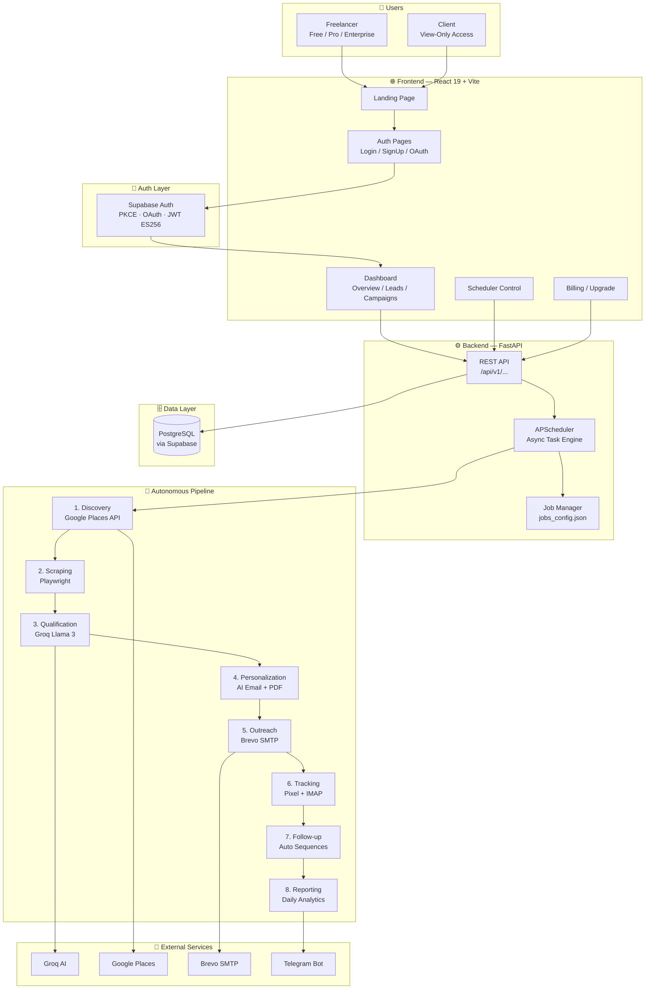
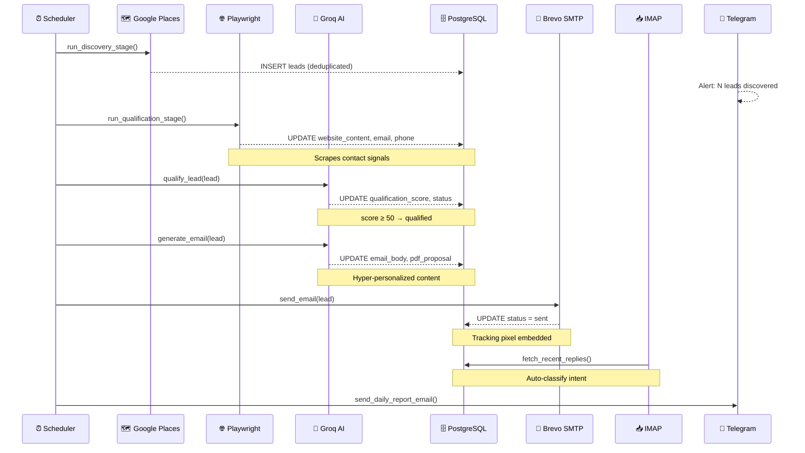
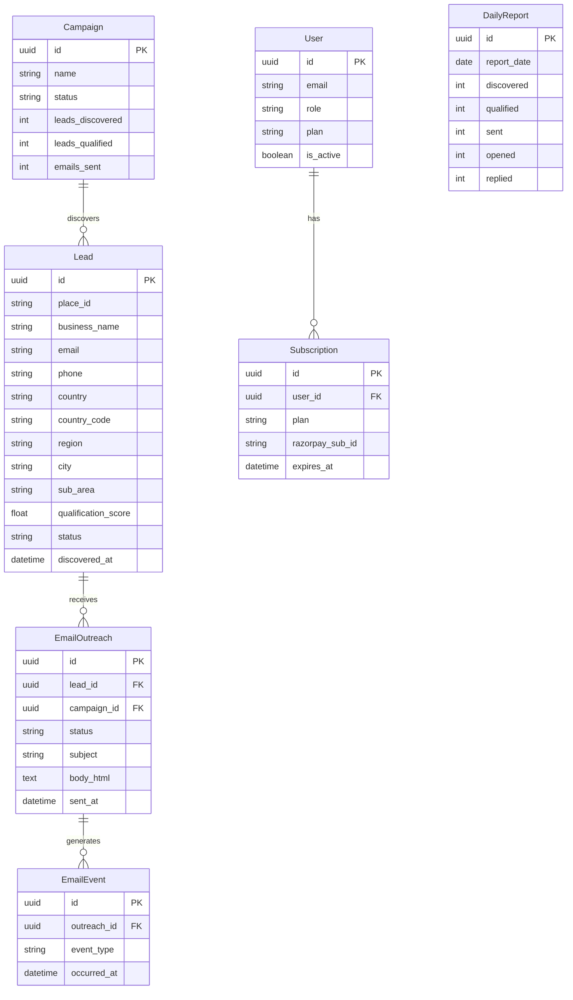
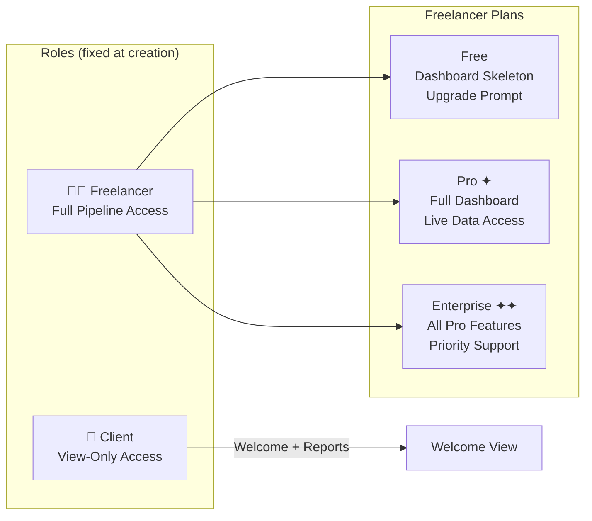

<div align="center">

<svg xmlns="http://www.w3.org/2000/svg" viewBox="0 0 900 120" width="900" height="120">
  <defs>
    <linearGradient id="bg" x1="0%" y1="0%" x2="100%" y2="0%">
      <stop offset="0%" style="stop-color:#000000;stop-opacity:1" />
      <stop offset="50%" style="stop-color:#1a1a1a;stop-opacity:1" />
      <stop offset="100%" style="stop-color:#000000;stop-opacity:1" />
    </linearGradient>
    <linearGradient id="text-grad" x1="0%" y1="0%" x2="100%" y2="0%">
      <stop offset="0%" style="stop-color:#ffffff;stop-opacity:1" />
      <stop offset="50%" style="stop-color:#cccccc;stop-opacity:1" />
      <stop offset="100%" style="stop-color:#ffffff;stop-opacity:1" />
    </linearGradient>
  </defs>
  <rect width="900" height="120" fill="url(#bg)" rx="12"/>
  <text x="450" y="55" font-family="Inter, system-ui, sans-serif" font-size="42" font-weight="800" fill="url(#text-grad)" text-anchor="middle" letter-spacing="2">COLD SCOUT</text>
  <text x="450" y="88" font-family="Inter, system-ui, sans-serif" font-size="16" fill="#888888" text-anchor="middle" letter-spacing="8">AI LEAD GENERATION SYSTEM</text>
  <line x1="200" y1="105" x2="700" y2="105" stroke="#333333" stroke-width="1"/>
</svg>

<br/>

<a href="https://readme-typing-svg.demolab.com"></a>

<br/>

[](https://python.org)
[](https://fastapi.tiangolo.com)
[](https://react.dev)
[](https://typescriptlang.org)
[](https://postgresql.org)
[](https://docker.com)
[](https://supabase.com)

<br/>

[](LICENSE)
[](CONTRIBUTING.md)
[](https://render.com)
[](https://vercel.com)

</div>

---

## 📖 Table of Contents

| Section | Description |
|---------|-------------|
| [Brand Identity](#-brand-identity) | Vision, mission, and design philosophy |
| [Project Overview](#-project-overview) | What Cold Scout does and why |
| [Monorepo Structure](#-monorepo-structure) | How the repo is organized |
| [System Architecture](#-system-architecture) | Full pipeline and data flow diagrams |
| [Tech Stack](#-tech-stack) | Complete technology inventory |
| [Key Features](#-key-features) | Platform capabilities overview |
| [Pipeline Stages](#-pipeline-stages) | Step-by-step AI automation flow |
| [User Roles & Plans](#-user-roles--plans) | RBAC and billing tier details |
| [Quick Start](#-quick-start) | Get running in under 10 minutes |
| [Environment Variables](#-environment-variables) | All 46 configuration parameters |
| [Deployment](#-deployment) | Production deployment guide |
| [Testing](#-testing) | Test suite overview |
| [Contributing](#-contributing) | How to contribute |

---

## 🏛 Brand Identity

### Vision
> *To completely automate the B2B sales development lifecycle with intelligent, autonomous AI agents — eliminating the friction between prospect discovery and meaningful engagement.*

### Mission
Empowering high-performance B2B sales teams and freelancers with a tireless, 24/7 AI-driven outreach pipeline that discovers, qualifies, and engages ideal prospects at scale — without human intervention.

### Design Philosophy

```
  ┌─────────────────────────────────────────────────────┐
  │  Visual Identity: Monochromatic Elegance             │
  │                                                      │
  │  Primary  ██████  #000000  Black — Authority          │
  │  Surface  ██████  #FFFFFF  White  — Clarity           │
  │  Accent   ██████  #888888  Gray   — Sophistication    │
  │                                                      │
  │  UX: Glassmorphism · Micro-animations · Responsive  │
  └─────────────────────────────────────────────────────┘
```

---

## 🚀 Project Overview

**Cold Scout** is an enterprise-grade, end-to-end B2B lead generation platform. The system functions as a fully autonomous Sales Development Representative (SDR), capable of:

1. **Discovering** local businesses via Google Places API with international multi-country targeting and paginated results (up to 60 per location)
2. **Scraping** company websites with Playwright to extract contact signals (email, phone, social)
3. **Qualifying** leads using Groq AI (Llama 3) against configurable Ideal Customer Profiles (ICPs)
4. **Personalizing** outreach campaigns with AI-generated emails, PDF proposals, and XLSX reports
5. **Sending** hyper-personalized cold emails via Brevo SMTP with built-in throttling
6. **Tracking** opens, clicks, and replies — auto-classifying intent (positive/negative/OOO)
7. **Following up** with automated multi-step sequences for non-responsive prospects
8. **Reporting** daily analytics reports to admin email with full conversion funnel metrics

---

## 📁 Monorepo Structure

```
coldscout/                          ← Monorepo Root
│
├── 📂 backend/                     ← FastAPI Application (Python 3.11+)
│   ├── app/
│   │   ├── api/v1/                 ← REST API routes (auth, leads, billing, ...)
│   │   ├── core/                   ← Database, scheduler, locks, security
│   │   ├── models/                 ← SQLAlchemy ORM models
│   │   ├── modules/                ← Business logic (discovery, AI, email, ...)
│   │   ├── schemas/                ← Pydantic request/response schemas
│   │   └── tasks/                  ← Background pipeline tasks
│   ├── migrations/                 ← Alembic database migrations
│   ├── scripts/                    ← Admin & setup utility scripts
│   ├── tests/                      ← Pytest test suite (10 test files)
│   ├── Dockerfile                  ← Container image definition
│   ├── docker-compose.yml          ← Local stack orchestration
│   ├── requirements.txt            ← Python dependencies
│   ├── README.md                   ← Backend documentation
│   └── DEPLOYMENT.md               ← Backend deployment guide
│
├── 📂 frontend/                    ← React 19 Dashboard (Vite + TypeScript)
│   ├── src/
│   │   ├── components/             ← Reusable UI components
│   │   ├── hooks/                  ← Custom React hooks
│   │   ├── lib/                    ← Utilities, API client, Supabase
│   │   └── pages/                  ← Route-level page components (24 pages)
│   ├── server/                     ← Dev-only Node.js proxy server
│   ├── public/                     ← Static assets
│   ├── nginx.conf                  ← Production nginx configuration
│   ├── vercel.json                 ← Vercel deployment configuration
│   ├── Dockerfile                  ← Frontend container image
│   ├── README.md                   ← Frontend documentation
│   └── DEPLOYMENT.md               ← Frontend deployment guide
│
├── 📂 .github/
│   └── workflows/
│       ├── ci.yml                  ← CI: tests, lint, build checks
│       ├── pipeline-health-check.yml ← Daily health monitoring
│       └── setup_cronjob.yml       ← Uptime cron registration
│
├── 📂 docs/                        ← Additional documentation
├── docker-compose.yml              ← Full-stack local orchestration
├── .env.example                    ← Environment template (42 variables)
├── README.md                       ← This file
└── DEPLOYMENT.md                   ← Production deployment master guide
```

---

## 🏗 System Architecture

### High-Level Overview



### Autonomous Pipeline Flow



### Database Entity Relationships



---

## 🛠 Tech Stack

### Backend

| Layer | Technology | Purpose |
|-------|-----------|---------|
| **API Framework** | FastAPI 0.115 | Async REST API with OpenAPI docs |
| **Runtime** | Python 3.11+ | Core language |
| **Database ORM** | SQLAlchemy 2.0 (async) | Database abstraction layer |
| **Database Driver** | asyncpg 0.30 | Async PostgreSQL driver |
| **Migrations** | Alembic 1.13 | Schema version control |
| **Scheduler** | APScheduler 3.10 | Cron/interval background tasks |
| **AI Engine** | Groq SDK (Llama 3) | Lead qualification + email generation |
| **Web Scraping** | Playwright 1.48 | Headless browser automation |
| **HTTP Client** | HTTPX 0.27 | Async HTTP requests |
| **HTML Parsing** | BeautifulSoup4 | Website content extraction |
| **Email Sending** | aiosmtplib 3.0 | Async SMTP delivery |
| **Email Templates** | Jinja2 3.1 | HTML email rendering |
| **PDF Generation** | ReportLab + WeasyPrint | Proposal document creation |
| **Excel Reports** | openpyxl 3.1 | Analytics spreadsheet export |
| **Authentication** | Supabase + PyJWT | ES256 JWT verification |
| **Payment** | Razorpay 1.4 | Subscription billing |
| **Notifications** | python-telegram-bot 21.6 | Real-time Telegram alerts |
| **Rate Limiting** | SlowAPI 0.1 | API endpoint throttling |
| **Retry Logic** | Tenacity 9.0 | Resilient external API calls |
| **Logging** | Loguru 0.7 | Structured application logging |
| **Validation** | Pydantic v2 | Request/response schemas |
| **Containerization** | Docker + Docker Compose | Environment reproducibility |

### Frontend

| Layer | Technology | Purpose |
|-------|-----------|---------|
| **UI Framework** | React 19 | Component-based UI |
| **Language** | TypeScript 5.9 | Type-safe development |
| **Build Tool** | Vite 8 | Ultra-fast dev server & bundler |
| **Styling** | TailwindCSS 3.4 | Utility-first CSS |
| **Routing** | React Router 7 | Client-side navigation |
| **Data Fetching** | TanStack Query v5 | Server state management + caching |
| **HTTP Client** | Axios | API communication |
| **Animation** | Framer Motion 12 | Micro-animations |
| **Charts** | Recharts 3 | Analytics visualizations |
| **Auth** | Supabase JS SDK 2 | Authentication provider |
| **Code Editor** | Monaco Editor | JSON config editing |
| **Icons** | Lucide React | Icon system |
| **Virtualization** | react-window | Large list rendering |
| **Notifications** | react-hot-toast | Toast notifications |
| **Dev Proxy** | Node.js (Express) | X-API-Key injection |

---

## ✨ Key Features

<details>
<summary><b>🔍 Organic Lead Discovery</b></summary>

- Programmatically queries **Google Places API** with international multi-country targeting
- Full location hierarchy: Country → Region → City → Sub-Area (neighborhood/district)
- `regionCode` and `locationBias` for precise geographic scoping across countries
- Paginated results (up to 60 per location via `nextPageToken`)
- Structured geo extraction from `addressComponents` (country, region, postal code, lat/lng)
- Intelligent deduplication via `place_id` and email matching — never re-discovers known leads
- `SearchHistory` model prevents redundant API spend within cooling periods
- Configurable via `DISCOVERY_COUNTRY_FOCUS`, `DISCOVERY_DEPTH`, `DISCOVERY_TARGET_COUNT`, `DISCOVERY_MAX_PAGES`

</details>

<details>
<summary><b>🤖 AI-Powered Qualification</b></summary>

- **Playwright** headless browser scrapes company websites for contact signals
- Extracts: emails, phone numbers, social profiles (LinkedIn, Twitter, Instagram, Facebook)
- **Groq AI (Llama 3.1)** scores leads 0–100 against configurable ICP criteria
- Qualification status machine: `discovered → qualified → phone_qualified → rejected`
- Score ≥ 50 with email → `qualified` (automated email sequence)
- Score ≥ 50 with phone only → `phone_qualified` (manual WhatsApp alert)

</details>

<details>
<summary><b>✉️ Hyper-Personalized Outreach</b></summary>

- AI generates unique email for every qualified lead based on their website analysis
- Embeds tracking pixel (1×1 transparent PNG) for open detection
- Attaches PDF proposal and XLSX data package per lead
- Brevo SMTP delivery with configurable throttle (`EMAIL_SEND_INTERVAL_SECONDS`)
- Jinja2 HTML templates for responsive, branded emails

</details>

<details>
<summary><b>📊 Real-Time Dashboard</b></summary>

- Live pipeline monitoring across all 5 stages
- Full lead lifecycle management with qualifier score display
- Campaign creation, pausing, and management
- Scheduler override — manually trigger any pipeline stage
- Analytics with funnel charts, bar charts, and conversion metrics
- Inbox — auto-classified replies by intent (positive / negative / OOO)

</details>

<details>
<summary><b>🔐 Enterprise Authentication</b></summary>

- Supabase Auth with **PKCE flow** for OAuth providers
- Supported providers: Email/password, Google, GitHub, Facebook, LinkedIn
- Backend validates JWT with **ES256** via Supabase JWKS endpoint
- Role-based access: `freelancer` (full access) vs `client` (view-only)
- Plan gating: Free / Pro / Enterprise tiers for freelancers
- Session expiry modal with graceful re-authentication

</details>

<details>
<summary><b>💳 Razorpay Billing</b></summary>

- INR-denominated subscription plans (Free / Pro / Enterprise)
- Razorpay order creation → payment verification → subscription activation
- Webhook handler for payment events with HMAC signature validation
- Scheduled billing task for subscription expiry management
- Upgrade modal with plan comparison table

</details>

<details>
<summary><b>📲 Smart Notifications</b></summary>

- Telegram bot alerts for: new lead discoveries, qualified leads, daily reports, system errors
- WhatsApp alerts (via CallMeBot) for phone-qualified leads requiring manual action
- GitHub Actions daily health check with automated status reporting

</details>

<details>
<summary><b>🧵 Threads Integration</b></summary>

- Meta Threads API integration for social outreach discovery
- Autonomous discovery, qualification, and engagement pipeline
- Rate-limited client with token management and retry logic

</details>

---

## 🔄 Pipeline Stages

```
┌────────────────────────────────────────────────────────────────────────────┐
│                     COLD SCOUT AUTONOMOUS PIPELINE                         │
│                                                                            │
│  Stage 1        Stage 2        Stage 3        Stage 4        Stage 5       │
│                                                                            │
│  ┌──────┐      ┌──────┐      ┌──────┐      ┌──────┐      ┌──────┐        │
│  │DISCOV│ ───▶ │SCRAPE│ ───▶ │QUALIF│ ───▶ │PERSON│ ───▶ │OUTREA│        │
│  │  ERY │      │  &   │      │ICATI │      │ALIZA │      │  CH  │        │
│  │      │      │ENRICH│      │  ON  │      │  TION│      │      │        │
│  └──────┘      └──────┘      └──────┘      └──────┘      └──────┘        │
│  Google        Playwright    Groq AI        Groq AI        Brevo          │
│  Places API    BeautifulSoup  Llama 3        Email + PDF    SMTP           │
│  ↓             ↓              ↓              ↓              ↓              │
│  Stage 6       Stage 7        Stage 8                                      │
│  ┌──────┐      ┌──────┐      ┌──────┐                                     │
│  │TRACK │ ───▶ │FOLLOW│ ───▶ │REPORT│                                     │
│  │  ING │      │  -UP │      │  ING │                                     │
│  └──────┘      └──────┘      └──────┘                                     │
│  Pixel +       Auto          Daily          All stages run on             │
│  IMAP          Sequences     Analytics      APScheduler cron              │
└────────────────────────────────────────────────────────────────────────────┘
```

Each stage is independently schedulable via `jobs_config.json` with hour/minute precision. The **Job Manager** allows pausing, resuming, and manual triggering of any individual stage from the dashboard.

---

## 👥 User Roles & Plans



| Feature | Free | Pro | Enterprise | Client |
|---------|------|-----|-----------|--------|
| Dashboard Overview | Skeleton | ✅ Live | ✅ Live | ✅ Welcome |
| Lead Management | ❌ | ✅ | ✅ | ❌ |
| Pipeline Control | ❌ | ✅ | ✅ | ❌ |
| Campaign Management | ❌ | ✅ | ✅ | ❌ |
| Analytics | ❌ | ✅ | ✅ | ✅ Reports |
| Scheduler Override | ❌ | ✅ | ✅ | ❌ |
| Inbox | ❌ | ✅ | ✅ | ❌ |
| Billing Management | ✅ Upgrade | ✅ | ✅ | ❌ |

---

## 💻 Quick Start

### Prerequisites

| Requirement | Version |
|-------------|---------|
| Python | 3.11+ |
| Node.js | 18+ |
| PostgreSQL | 14+ (or Supabase) |
| Docker & Compose | Latest (optional but recommended) |

### Option A: Docker (Recommended)

```bash
# 1. Clone the repository
git clone https://github.com/colddsam/coldscout.git
cd coldscout

# 2. Copy and configure environment
cp .env.example .env
# Edit .env with your API keys

# 3. Launch full stack
docker-compose up --build
```

> API available at `http://localhost:8000/docs` · Dashboard at `http://localhost:5173`

### Option B: Manual Setup

```bash
# ── Backend ──────────────────────────────────────────────────
cd backend
python -m venv venv && source venv/bin/activate  # Windows: venv\Scripts\activate
pip install -r requirements.txt
playwright install chromium

# Configure environment
cp .env.example .env    # Fill in required values

# Initialize database
python scripts/create_tables.py
python scripts/seed_admin.py

# Start API server
uvicorn app.main:app --reload --host 127.0.0.1 --port 8000

# ── Frontend (new terminal) ───────────────────────────────────
cd frontend
npm install

# Configure environment
# Create .env.local with VITE_SUPABASE_URL, VITE_SUPABASE_ANON_KEY, VITE_PROXY_URL, VITE_API_KEY

# Start dashboard
npm run dev
```

---

## 🔐 Environment Variables

> See [DEPLOYMENT.md](./DEPLOYMENT.md) for detailed setup instructions for each service.

| Category | Variable | Description |
|----------|----------|-------------|
| **Security** | `APP_ENV` | `production` or `development` |
| | `APP_SECRET_KEY` | Hex session secret |
| | `API_KEY` | System-level auth key |
| | `SECURITY_SALT` | Encrypted fallback hash |
| | `BACKEND_CORS_ORIGINS` | Comma-delimited allowed origins |
| | `APP_URL` | Application root URL |
| **Database** | `DATABASE_URL` | `postgresql+asyncpg://...` URI |
| | `SUPABASE_URL` | Supabase project URL |
| | `SUPABASE_ANON_KEY` | Supabase public key |
| **AI** | `GROQ_API_KEY` | Groq Cloud API key |
| | `GROQ_MODEL` | `llama-3.1-8b-instant` (default) |
| | `GOOGLE_PLACES_API_KEY` | Maps Places API key |
| **Outreach** | `BREVO_SMTP_HOST/PORT/USER/PASSWORD` | SMTP relay credentials |
| | `FROM_EMAIL` / `FROM_NAME` | Sender identity |
| | `REPLY_TO_EMAIL` | Reply routing address |
| **Tracking** | `IMAP_HOST/USER/PASSWORD` | Inbound email sync |
| **Alerts** | `TELEGRAM_BOT_TOKEN/CHAT_ID` | Notification bot |
| | `WHATSAPP_NUMBER/CALLMEBOT_API_KEY` | WhatsApp alerts |
| **Scheduling** | `DISCOVERY_HOUR/QUALIFICATION_HOUR` | Pipeline execution times |
| | `PERSONALIZATION_HOUR/OUTREACH_HOUR` | Continued scheduling |
| | `REPORT_HOUR/REPORT_MINUTE` | Analytics execution |
| **Discovery** | `DISCOVERY_COUNTRY_FOCUS` | Comma-separated ISO country codes (e.g. `IN,US,AE`) |
| | `DISCOVERY_TARGET_COUNT` | Targets per daily run (default: 4) |
| | `DISCOVERY_DEPTH` | Location depth: `country`/`region`/`city`/`sub_area` |
| | `DISCOVERY_MAX_PAGES` | Google Places pages per search (1-3) |
| **Billing** | `RAZORPAY_KEY_ID/KEY_SECRET` | Payment gateway |
| **Frontend** | `VITE_SUPABASE_URL/ANON_KEY` | Auth provider |
| | `VITE_PROXY_URL` | Backend URL for proxy |
| | `VITE_API_KEY` | Must match backend `API_KEY` |

---

## 🚢 Deployment

The production stack is deployed across three specialized platforms:

```
┌──────────────────────────────────────────────────────┐
│                 PRODUCTION TOPOLOGY                   │
│                                                      │
│  ┌──────────┐    ┌──────────┐    ┌──────────┐       │
│  │ Supabase │    │  Render  │    │  Vercel  │       │
│  │          │    │          │    │          │       │
│  │PostgreSQL│◀───│ FastAPI  │◀───│ React 19 │       │
│  │   Auth   │    │ Backend  │    │Dashboard │       │
│  │  Managed │    │ Docker   │    │  CDN Edge│       │
│  └──────────┘    └──────────┘    └──────────┘       │
│      DB Tier        API Tier      Frontend Tier      │
└──────────────────────────────────────────────────────┘
```

Refer to **[DEPLOYMENT.md](./DEPLOYMENT.md)** for step-by-step production deployment instructions.

- **Backend**: [backend/DEPLOYMENT.md](./backend/DEPLOYMENT.md) — Render + Docker
- **Frontend**: [frontend/DEPLOYMENT.md](./frontend/DEPLOYMENT.md) — Vercel + Nginx

---

## 🧪 Testing

The backend includes a comprehensive pytest test suite with 10 test modules:

```
tests/
├── test_01_api_health.py          ← Health endpoint checks
├── test_02_database_operations.py ← CRUD and DB operations
├── test_03_discovery_module.py    ← Google Places integration
├── test_04_daily_pipeline.py      ← Full pipeline orchestration
├── test_05_e2e_scenarios.py       ← End-to-end user scenarios
├── test_06_followup_engine.py     ← Follow-up sequence logic
├── test_07_reply_classifier.py    ← Intent classification
├── test_08_enrichment_modules.py  ← Scraping & enrichment
├── test_09_pipeline_api.py        ← Pipeline REST endpoints
└── test_10_leads_api.py           ← Leads REST endpoints
```

```bash
cd backend
pytest tests/ -v
```

CI runs automatically on every push via `.github/workflows/ci.yml`.

---

## 💖 Support the Project

If Cold Scout accelerates your B2B operations, please consider supporting its development:

<a href="https://github.com/sponsors/colddsam">
  
</a>

---

<div align="center">

**[⭐ Star this repo](https://github.com/colddsam/coldscout)** if Cold Scout is useful to you.

<br/>

*Engineered for High-Performance B2B Strategic Operations.*

<br/>

[](https://github.com/colddsam)

</div>
