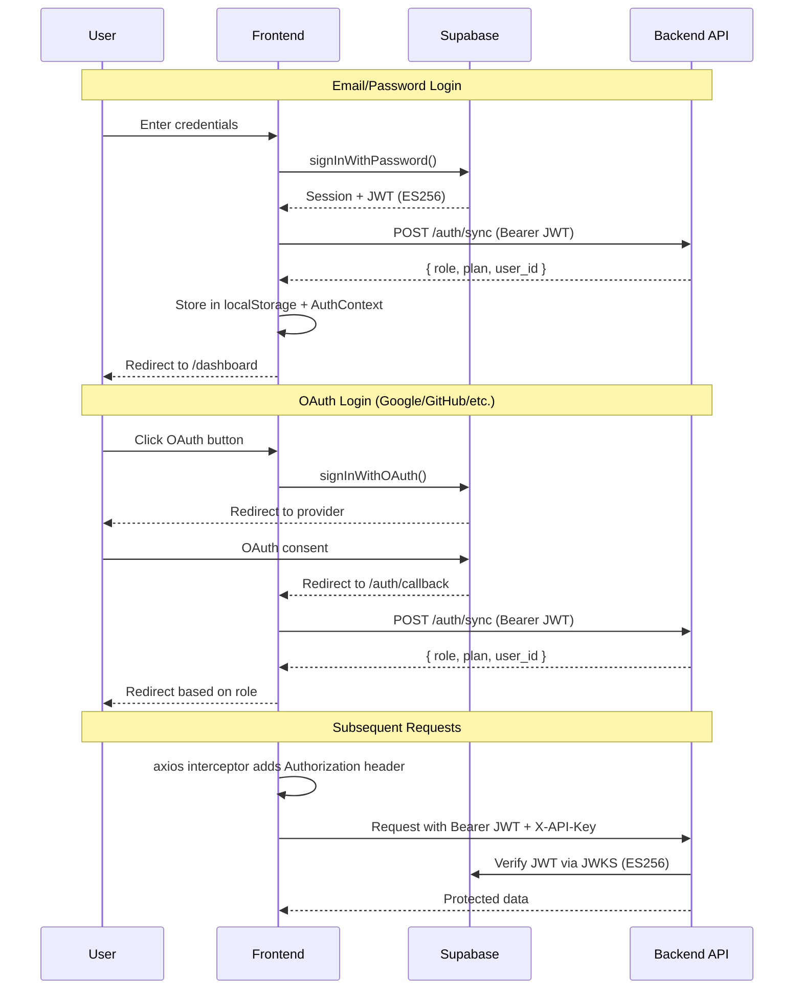

<div align="center">

<svg xmlns="http://www.w3.org/2000/svg" viewBox="0 0 800 100" width="800" height="100">
  <defs>
    <linearGradient id="bg3" x1="0%" y1="0%" x2="100%" y2="0%">
      <stop offset="0%" style="stop-color:#0a0a0a;stop-opacity:1" />
      <stop offset="100%" style="stop-color:#1c1c1c;stop-opacity:1" />
    </linearGradient>
  </defs>
  <rect width="800" height="100" fill="url(#bg3)" rx="10"/>
  <text x="400" y="40" font-family="monospace" font-size="13" fill="#444444" text-anchor="middle">🖥️  COLD SCOUT</text>
  <text x="400" y="65" font-family="Inter, system-ui, sans-serif" font-size="28" font-weight="700" fill="#ffffff" text-anchor="middle">Frontend Dashboard</text>
  <text x="400" y="88" font-family="monospace" font-size="12" fill="#555555" text-anchor="middle">React 19 · TypeScript · Vite · TailwindCSS · Supabase Auth</text>
</svg>

<br/>

[](https://react.dev)
[](https://typescriptlang.org)
[](https://vitejs.dev)
[](https://tailwindcss.com)
[](https://supabase.com)
[](https://tanstack.com/query)

</div>

---

## 📖 Overview

The **Cold Scout Dashboard** is the command center for the AI lead generation pipeline. Built with **React 19** and **Vite 8**, it provides:

- **Real-time pipeline monitoring** across all 8 automation stages
- **Lead lifecycle management** with AI qualification scores
- **Campaign creation and management** with targeting controls
- **Analytics** with interactive funnel charts and conversion metrics
- **Billing management** with Razorpay plan upgrades
- **Inbox** with AI-classified reply intent
- **Role-based access** for `freelancer` and `client` users
- **Plan gating** — Free tier shows skeleton + upgrade prompt; Pro/Enterprise shows live data

---

## 📁 Directory Structure

```
frontend/
│
├── src/
│   │
│   ├── components/                     ← Reusable UI components
│   │   ├── auth/
│   │   │   ├── ProtectedRoute.tsx      ← Auth guard (requires login)
│   │   │   └── SessionExpiredModal.tsx ← Auto-logout modal on token expiry
│   │   │
│   │   ├── charts/
│   │   │   ├── BarChart.tsx            ← Recharts bar chart wrapper
│   │   │   ├── FunnelChart.tsx         ← Pipeline conversion funnel
│   │   │   └── LineChart.tsx           ← Trend line chart wrapper
│   │   │
│   │   ├── dashboard/
│   │   │   ├── DashboardSkeleton.tsx   ← Loading skeleton for Free tier
│   │   │   └── UpgradeModal.tsx        ← Plan upgrade CTA modal
│   │   │
│   │   ├── layout/
│   │   │   ├── Shell.tsx               ← App shell (sidebar + topbar + content)
│   │   │   ├── Sidebar.tsx             ← Navigation sidebar
│   │   │   ├── Topbar.tsx              ← Header with user menu
│   │   │   ├── PageHeader.tsx          ← Consistent page title header
│   │   │   ├── PublicNavbar.tsx        ← Landing page navigation
│   │   │   └── PublicFooter.tsx        ← Landing page footer
│   │   │
│   │   ├── seo/
│   │   │   └── JsonLd.tsx              ← JSON-LD structured data injector
│   │   │
│   │   └── ui/                         ← Atomic design-system components
│   │       ├── Badge.tsx               ← Status/category badge
│   │       ├── Button.tsx              ← Multi-variant button
│   │       ├── Card.tsx                ← Content container card
│   │       ├── Countdown.tsx           ← Timer countdown display
│   │       ├── DataTable.tsx           ← Virtualized sortable table
│   │       ├── JsonEditor.tsx          ← Monaco-based JSON editor
│   │       ├── Logo.tsx                ← Brand logo component
│   │       ├── Modal.tsx               ← Accessible modal dialog
│   │       ├── Spinner.tsx             ← Loading indicator
│   │       ├── StatusDot.tsx           ← Live status indicator dot
│   │       ├── Toast.tsx               ← Notification toast wrapper
│   │       └── Toggle.tsx              ← On/off toggle switch
│   │
│   ├── hooks/                          ← Custom React hooks (data + state)
│   │   ├── useAuth.tsx                 ← AuthProvider + useAuth — central auth state
│   │   ├── useAnalytics.ts             ← Funnel and metrics data fetching
│   │   ├── useBilling.ts               ← Subscription and payment hooks
│   │   ├── useCampaigns.ts             ← Campaign CRUD operations
│   │   ├── useConfig.ts                ← Pipeline configuration management
│   │   ├── useInbox.ts                 ← Reply inbox data fetching
│   │   ├── useJobs.ts                  ← Scheduler job status and control
│   │   ├── useLeads.ts                 ← Lead list, filtering, mutations
│   │   ├── usePipeline.ts              ← Pipeline stage status and triggers
│   │   ├── useSEO.ts                   ← Page-level meta tag management
│   │   └── useThreads.ts               ← Threads social outreach data
│   │
│   ├── lib/                            ← Utilities and clients
│   │   ├── api.ts                      ← Axios client with JWT interceptor
│   │   ├── constants.ts                ← App-wide constants (plans, routes, etc.)
│   │   ├── supabase.ts                 ← Supabase client, auth helpers
│   │   └── utils.ts                    ← Formatting and utility functions
│   │
│   ├── pages/                          ← Route-level view components
│   │   ├── LandingPage.tsx             ← Public marketing page
│   │   ├── Login.tsx                   ← Email/password + OAuth login
│   │   ├── SignUp.tsx                  ← Registration with role selection
│   │   ├── AuthCallback.tsx            ← OAuth redirect handler
│   │   ├── Welcome.tsx                 ← Client role welcome page
│   │   ├── Overview.tsx                ← Dashboard overview (key metrics)
│   │   ├── Leads.tsx                   ← Lead list with filters & pagination
│   │   ├── LeadDetail.tsx              ← Single lead detail view
│   │   ├── Campaigns.tsx               ← Campaign management
│   │   ├── Pipeline.tsx                ← Live pipeline stage monitor
│   │   ├── Scheduler.tsx               ← Scheduler job control panel
│   │   ├── Analytics.tsx               ← Charts and conversion analytics
│   │   ├── Inbox.tsx                   ← Email reply inbox
│   │   ├── Threads.tsx                 ← Meta Threads outreach
│   │   ├── Billing.tsx                 ← Plan management & upgrade
│   │   ├── Settings.tsx                ← User profile settings
│   │   ├── Pricing.tsx                 ← Public pricing page
│   │   ├── Documentation.tsx           ← In-app documentation
│   │   ├── Support.tsx                 ← Support contact page
│   │   ├── Privacy.tsx                 ← Privacy policy page
│   │   ├── Terms.tsx                   ← Terms of service page
│   │   ├── RefundPolicy.tsx            ← Refund policy page
│   │   ├── DataDeletion.tsx            ← GDPR data deletion request
│   │   ├── LeadDemoViewer.tsx         ← Public demo website viewer (sandboxed iframe)
│   │   ├── Profile.tsx                ← User profile management
│   │   ├── PublicProfile.tsx          ← Public profile view (/u/:username)
│   │   └── NotFound.tsx                ← 404 error page
│   │
│   ├── App.tsx                         ← React Router route tree
│   ├── main.tsx                        ← React 19 entry point
│   ├── App.css                         ← Global application styles
│   └── index.css                       ← Tailwind base imports
│
├── server/                             ← Development-only Node.js proxy
│   └── index.ts                        ← Express proxy (injects X-API-Key)
│
├── public/                             ← Static public assets
│   ├── favicon.ico
│   ├── robots.txt
│   ├── sitemap.xml
│   └── og-image.png
│
├── dist/                               ← Production build output (gitignored)
│
├── nginx.conf                          ← Production nginx configuration
├── Dockerfile                          ← Frontend container image
├── vercel.json                         ← Vercel routing + CSP headers
├── vite.config.ts                      ← Vite build configuration
├── tailwind.config.ts                  ← Tailwind theme configuration
├── tsconfig.json                       ← TypeScript configuration
├── package.json                        ← Dependencies and scripts
├── README.md                           ← This file
└── DEPLOYMENT.md                       ← Frontend deployment guide
```

---

## 🗺 Routing Architecture

```mermaid
graph TD
    Root["/"] --> LP[LandingPage]
    Root --> Pricing["/pricing" → Pricing]
    Root --> Docs["/docs" → Documentation]
    Root --> Support["/support" → Support]
    Root --> Privacy["/privacy" → Privacy]
    Root --> Terms["/terms" → Terms]
    Root --> Refund["/refund" → RefundPolicy]
    Root --> DataDel["/data-deletion" → DataDeletion]
    Root --> Login["/login" → Login]
    Root --> Signup["/signup" → SignUp]
    Root --> Callback["/auth/callback" → AuthCallback]

    subgraph Protected[Protected Routes — requires auth]
        direction TB
        Shell[App Shell] --> Overview["/dashboard" → Overview]
        Shell --> Leads["/leads" → Leads]
        Shell --> LeadDetail["/leads/:id" → LeadDetail]
        Shell --> Campaigns["/campaigns" → Campaigns]
        Shell --> Pipeline["/pipeline" → Pipeline]
        Shell --> Scheduler["/scheduler" → Scheduler]
        Shell --> Analytics["/analytics" → Analytics]
        Shell --> Inbox["/inbox" → Inbox]
        Shell --> Threads["/threads" → Threads]
        Shell --> Billing["/billing" → Billing]
        Shell --> Settings["/settings" → Settings]
        Shell --> Welcome["/welcome" → Welcome]
    end

    Root --> Protected
    Root --> NotFound["* → 404 NotFound"]
```



### Role-Based Route Access

| Route | Freelancer (Free) | Freelancer (Pro+) | Client |
|-------|------------------|-------------------|--------|
| `/dashboard` | Skeleton view | Full dashboard | ❌ Redirects |
| `/welcome` | ❌ | ❌ | ✅ |
| `/leads` | ❌ Upgrade prompt | ✅ | ❌ |
| `/pipeline` | ❌ Upgrade prompt | ✅ | ❌ |
| `/campaigns` | ❌ Upgrade prompt | ✅ | ❌ |
| `/analytics` | ❌ Upgrade prompt | ✅ | ✅ |
| `/billing` | ✅ Upgrade CTA | ✅ Manage | ❌ |
| `/inbox` | ❌ | ✅ | ❌ |
| `/scheduler` | ❌ | ✅ | ❌ |

---

## 🔐 Authentication Architecture

### Auth Flow Diagram



### Auth Implementation Details

**`useAuth.tsx`** — Central auth context provider:
- Wraps the entire app, provides `user`, `role`, `plan`, `loading` state
- Subscribes to `supabase.auth.onAuthStateChange()` — keeps state in sync
- Calls `/api/v1/auth/sync` on each session to get role + plan from backend DB
- Role from backend DB is always authoritative (never trust frontend-only)

**`lib/api.ts`** — Axios instance with interceptors:
- Automatically attaches `Authorization: Bearer <jwt>` to every request
- On 401 response: clears auth state, shows `SessionExpiredModal`
- Injects `X-API-Key` header (from `VITE_API_KEY` env var)

**`lib/supabase.ts`** — Supabase client helpers:
- `signIn()`, `signUp()`, `signOut()`, `signInWithOAuth()`
- `getUserRole()` — reads role from backend DB (not Supabase metadata)
- Session stored in `localStorage` by Supabase JS SDK

---

## 🪝 Custom Hooks Reference

| Hook | File | Returns | Used By |
|------|------|---------|---------|
| `useAuth` | `useAuth.tsx` | `{ user, role, plan, loading, signOut }` | All protected pages |
| `useLeads` | `useLeads.ts` | `{ leads, total, isLoading, filters, setFilters, updateLead }` | Leads, LeadDetail |
| `usePipeline` | `usePipeline.ts` | `{ stages, triggerStage, isRunning }` | Pipeline, Overview |
| `useJobs` | `useJobs.ts` | `{ jobs, updateJob, toggleJob }` | Scheduler |
| `useCampaigns` | `useCampaigns.ts` | `{ campaigns, createCampaign, updateCampaign }` | Campaigns |
| `useAnalytics` | `useAnalytics.ts` | `{ funnel, daily, trends }` | Analytics |
| `useInbox` | `useInbox.ts` | `{ replies, classifyReply }` | Inbox |
| `useBilling` | `useBilling.ts` | `{ subscription, createOrder, verifyPayment }` | Billing |
| `useConfig` | `useConfig.ts` | `{ config, updateConfig }` | Settings, Scheduler |
| `useThreads` | `useThreads.ts` | `{ threads, stats }` | Threads |
| `useSEO` | `useSEO.ts` | Side effect — sets `<title>` and meta tags | All pages |

All data-fetching hooks are built on **TanStack Query v5** for:
- Automatic background refetching
- Stale-while-revalidate caching
- Optimistic updates for mutations
- Automatic retry on error

---

## 🎨 Design System

### Component Variants

**Button**
```tsx
<Button variant="primary" size="md">Save</Button>
<Button variant="ghost" size="sm">Cancel</Button>
<Button variant="danger" size="md">Delete</Button>
```

**Badge**
```tsx
<Badge status="qualified" />    // Green dot + "Qualified"
<Badge status="rejected" />     // Red dot + "Rejected"
<Badge status="sent" />         // Blue dot + "Sent"
<Badge plan="pro" />            // Gold "Pro" badge
```

**StatusDot**
```tsx
<StatusDot active={true} />     // Animated green pulse
<StatusDot active={false} />    // Static gray dot
```

### Theme

Cold Scout uses a **monochromatic design system**:

```css
/* Tailwind config extensions */
--color-brand:          #000000  /* Black — primary actions */
--color-surface:        #FFFFFF  /* White — content background */
--color-muted:          #888888  /* Gray — secondary text */
--color-border:         #E5E7EB  /* Light gray borders */
--color-accent:         #111111  /* Near-black for emphasis */
```

UI patterns used throughout:
- **Glassmorphism** — frosted-glass cards with `backdrop-blur`
- **Micro-animations** — `framer-motion` for page transitions and state changes
- **Virtualized lists** — `react-window` + `react-virtualized-auto-sizer` for large lead tables

---

## 🔧 Build System

### Scripts

| Command | Description |
|---------|-------------|
| `npm run dev` | Start Vite + Node proxy server concurrently |
| `npm run dev:vite` | Start only Vite dev server (port 5173) |
| `npm run dev:proxy` | Start only the Node.js API proxy (port 3001) |
| `npm run build` | TypeScript check + Vite production build |
| `npm run preview` | Preview production build locally |
| `npm run lint` | Run ESLint on all source files |

### Development Proxy (`server/index.ts`)

In development, requests to `/api/*` are proxied through a Node.js Express server that:
1. Injects `X-API-Key: ${VITE_API_KEY}` header server-side
2. Forwards to `VITE_PROXY_URL` (your local or remote FastAPI backend)
3. Prevents the API key from ever appearing in browser network tabs

**Why this matters**: The `X-API-Key` must authenticate with the backend but cannot be hardcoded in frontend JavaScript. The proxy pattern keeps it server-side in development, matching how Vercel handles it in production.

### Vite Configuration

```typescript
// vite.config.ts highlights
export default defineConfig({
  plugins: [react()],
  server: {
    port: 5173,
    proxy: { '/api': 'http://localhost:3001' }  // Routes to Node proxy
  },
  build: {
    rollupOptions: {
      output: {
        manualChunks: {
          vendor: ['react', 'react-dom'],
          charts: ['recharts'],
          editor: ['@monaco-editor/react']
        }
      }
    }
  }
})
```

---

## 🌐 SEO Implementation

The frontend has a comprehensive SEO setup:

| Feature | Implementation |
|---------|---------------|
| **Page titles** | `useSEO.ts` hook per page |
| **Meta description** | Set per-page via `useSEO` |
| **Open Graph** | OG tags in `index.html` + per-page overrides |
| **JSON-LD** | `JsonLd.tsx` component for structured data |
| **Sitemap** | `/public/sitemap.xml` |
| **Robots.txt** | `/public/robots.txt` |
| **CSP Headers** | Configured in `vercel.json` |

---

## 💻 Local Development Setup

### Prerequisites

- Node.js 18+ and npm
- Backend running at `http://localhost:8000` (see [backend README](../backend/README.md))

### 1. Install Dependencies

```bash
cd frontend
npm install
```

### 2. Configure Environment

Create `.env.local` in the `frontend/` directory:

```env
# Supabase Auth
VITE_SUPABASE_URL=https://your-project.supabase.co
VITE_SUPABASE_ANON_KEY=eyJ0eXAiOiJKV1Q...

# Backend connection
VITE_PROXY_URL=http://localhost:8000
VITE_API_KEY=your_api_key_matching_backend_API_KEY

# Branding (optional)
VITE_SITE_NAME=Cold Scout
```

> `.env.local` is in `.gitignore` — never commit real credentials.

### 3. Start Development Server

```bash
npm run dev
```

This starts **two processes concurrently**:
1. **Vite** on `http://localhost:5173` — the React app
2. **Node proxy** on `http://localhost:3001` — API key injection proxy

The dashboard is available at: **http://localhost:5173**

---

## 🏗 Production Build

```bash
npm run build
```

This runs:
1. `tsc -b` — TypeScript type checking
2. `vite build` — Bundles and optimizes for production
3. Output: `dist/` directory (fully static, deployable to any CDN)

### Build Output

```
dist/
├── index.html
├── assets/
│   ├── index-[hash].js       ← Main bundle
│   ├── vendor-[hash].js      ← React + dependencies
│   ├── charts-[hash].js      ← Recharts (lazy)
│   └── editor-[hash].js      ← Monaco Editor (lazy)
└── [static assets]
```

---

## 🔒 Security Notes

| Concern | Implementation |
|---------|---------------|
| `X-API-Key` exposure | Injected server-side by proxy (dev) / Vercel edge (prod) |
| JWT storage | Supabase SDK stores in `localStorage` (standard practice) |
| Role caching | `localStorage` role is display-only; backend re-verifies on every sync |
| CSP headers | Configured in `vercel.json` — blocks unauthorized script sources |
| OAuth redirect | Callback URL validated by Supabase + fixed in config |

---

<div align="center">

*See [DEPLOYMENT.md](./DEPLOYMENT.md) for Vercel deployment instructions.*

</div>
